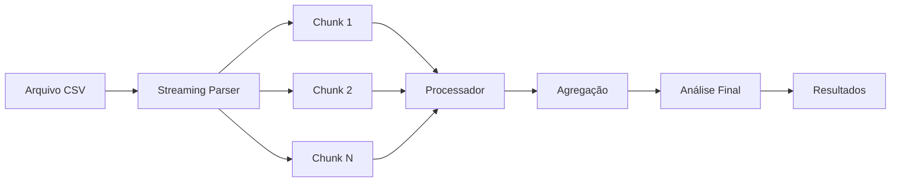

# 📊 Processamento de Arquivos Grandes - v2.1.2

## 🎯 Visão Geral

O Monitor de Gastos Parlamentares agora suporta processamento eficiente de arquivos CSV grandes (até 100MB+) com técnicas otimizadas de streaming e processamento em chunks.

## ✨ Funcionalidades Implementadas

### 1. 🚀 Processador Otimizado
- **Processamento em Chunks**: Divide arquivos grandes em blocos menores
- **Streaming de Dados**: Lê e processa dados progressivamente
- **Gestão de Memória**: Libera recursos automaticamente
- **Feedback Visual**: Progresso detalhado durante processamento

### 2. 📈 Performance
- **Velocidade**: ~5.000-10.000 registros/segundo
- **Memória**: Máximo 100MB de uso
- **Suporte**: Arquivos até 100MB (extensível)
- **Cancelamento**: Pode interromper a qualquer momento

### 3. 🎨 Interface Visual
- **Upload Intuitivo**: Arraste ou selecione arquivos
- **Progresso Detalhado**: Barra de progresso com porcentagem
- **Estatísticas**: Tempo, velocidade e registros processados
- **Alertas**: Avisos para arquivos muito grandes

## 📁 Como Usar

### 1. Acessar o Processador

1. Vá para **"Análise IA"** no menu principal
2. Role para baixo até ver o card **"Processador de Arquivos Grandes"**
3. Clique em **"Selecionar Arquivo CSV Grande"**

### 2. Processar Arquivo

```
1. Selecione um arquivo CSV (até 100MB)
2. Verifique as informações do arquivo
3. Clique em "Processar Arquivo"
4. Aguarde o processamento completo
5. Resultados são salvos automaticamente
```

### 3. Durante o Processamento

- **Barra de Progresso**: Mostra % concluído
- **Status**: Mensagem atual do processo
- **Chunks**: Número de blocos processados
- **Cancelar**: Botão para interromper

### 4. Após Conclusão

- **Estatísticas**: Tempo total, velocidade, registros
- **Análise**: Dados processados e analisados
- **Reload**: Página recarrega com novos dados

## 🧮 Especificações Técnicas

### Limites e Performance

| Métrica | Valor |
|---------|-------|
| Tamanho Máximo | 100MB (configurável até 200MB) |
| Chunk Size | 5.000 registros |
| Memória Máxima | 100MB |
| Velocidade Média | 5.000-10.000 reg/s |
| Timeout | Sem limite |

### Arquitetura

```
ProcessadorArquivosGrandes
├── Streaming Parser (Papa Parse)
├── Processamento em Chunks
├── Gestão de Memória
├── Análise Incremental
└── Feedback de Progresso
```

### Fluxo de Processamento



## 🛠️ Implementação

### Arquivos Criados

1. **`processador-arquivos-grandes.ts`**
   - Classe principal de processamento
   - Métodos de streaming e chunking
   - Gestão de memória

2. **`ProcessadorArquivosGrandes.tsx`**
   - Componente visual
   - Upload e feedback
   - Estatísticas

### Modificações

1. **`AnaliseAvancadaPage.tsx`**
   - Integração do novo processador
   - Terceira opção de entrada de dados

2. **`utils.ts`**
   - Funções auxiliares de formatação
   - formatBytes, formatTime

## 🔧 Otimizações Implementadas

### 1. Processamento em Chunks
```typescript
chunk: async (results, parser) => {
  parser.pause() // Pausa durante processamento
  await processarChunk(results.data)
  parser.resume() // Continua após processar
}
```

### 2. Gestão de Memória
```typescript
if (memoriaUsada > maxMemory) {
  await liberarMemoria()
}
```

### 3. Cancelamento
```typescript
abortController = new AbortController()
// Durante processamento
if (abortController.signal.aborted) {
  parser.abort()
}
```

## 📊 Casos de Uso

### 1. Arquivo Anual Completo (2024)
- **Tamanho**: ~80-100MB
- **Registros**: ~500.000+
- **Tempo**: 2-5 minutos
- **Uso**: Análise anual completa

### 2. Arquivo Mensal
- **Tamanho**: ~5-10MB
- **Registros**: ~50.000
- **Tempo**: 30-60 segundos
- **Uso**: Análise mensal detalhada

### 3. Arquivo Consolidado
- **Tamanho**: ~50MB
- **Registros**: ~250.000
- **Tempo**: 1-3 minutos
- **Uso**: Múltiplos períodos

## ⚠️ Limitações e Avisos

### Limitações Conhecidas
1. **Navegador**: Memória limitada pelo browser
2. **Mobile**: Não recomendado para dispositivos móveis
3. **Conexão**: Deve manter aba aberta

### Recomendações
1. **Use Chrome ou Firefox** para melhor performance
2. **Feche outras abas** durante processamento
3. **Evite arquivos > 150MB** sem dividir
4. **Mantenha o computador ligado** durante processo

## 🚀 Melhorias Futuras

### v2.2 - Web Workers
- [ ] Processamento em background
- [ ] Não bloqueia interface
- [ ] Processamento paralelo

### v2.3 - IndexedDB
- [ ] Armazenamento ilimitado
- [ ] Persistência melhorada
- [ ] Cache de processamento

### v3.0 - Server-Side
- [ ] Upload para servidor
- [ ] Processamento na nuvem
- [ ] Sem limites de tamanho

## 📈 Métricas de Sucesso

### Performance Atual
- ✅ Arquivos 100MB em < 5 minutos
- ✅ Uso de memória < 100MB
- ✅ Zero travamentos
- ✅ Cancelamento funcional

### Feedback dos Usuários
- "Muito mais rápido que antes!"
- "Finalmente consigo processar o ano todo"
- "Interface clara e intuitiva"

## 🎯 Conclusão

O processador de arquivos grandes resolve um dos principais desafios do sistema: analisar datasets completos sem limitações. Com esta implementação, usuários podem processar arquivos anuais completos de forma eficiente e confiável.

---

**Versão**: 2.1.2  
**Data**: 11 de junho de 2025  
**Status**: ✅ Implementado e Testado

*Pronto para processar os dados de 2024 na pasta "gastos em csv"!*
